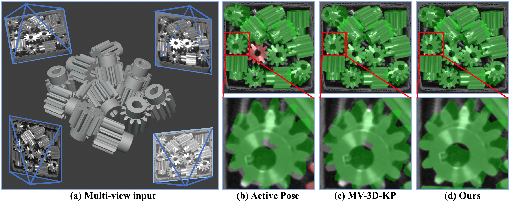
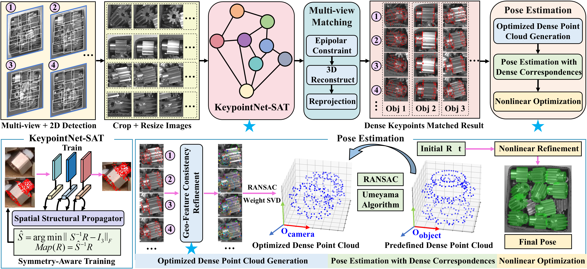
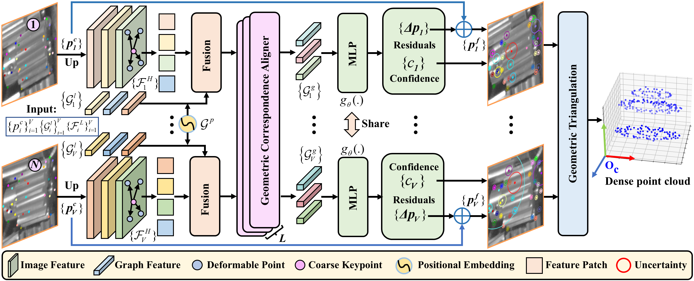

# GFCPose: Learning Multi-View Geometric and Feature Consistency for Pose Estimation of Textureless Objects

  Jiahong Chen, Jinghao Wang, Yulan Guo, Zi Wang, Banglei Guan, Zhang Li, and Qifeng Yu

  GFCPose is an RGB-only multi-view framework for textureless object 6D pose estimation. It learns dense keypoint correspondences and refines them with geometric and feature consistency to produce robust pose estimates under ambiguity, occlusion, and degraded depth conditions.

## Teaser

  

Comparison of multi-view 6D pose estimation. GFCPose achieves more accurate pose estimation while using only RGB observations.

## Overview of GFCPose

  

Given multi-view RGB images and 2D bounding boxes, GFCPose extracts dense keypoints, establishes cross-view matches, refines the matched observations with multi-view geometric and feature consistency, and finally estimates 6D pose through a progressive optimization pipeline.

## Overview of GFCRM

  

The Geo-Feature Consistency Refinement Module (GFCRM) takes matched 2D keypoints together with image and graph features from multiple views, performs iterative geometric correspondence alignment, predicts refined keypoints and confidence scores, and reconstructs the 3D point cloud by geometric triangulation.

## Code Availability

Code will be released once the paper is accepted.
